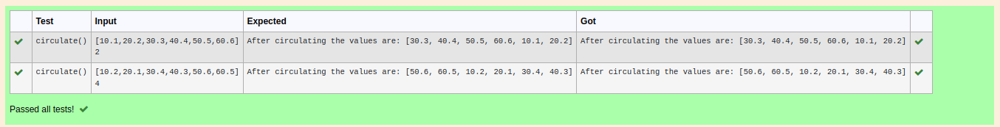

# Circulate-the-values-of-N-variables
## Aim:
To write a python program to circulate the n variables using function concept
## Equipment’s required:
PC
Anaconda - Python 3.7
## Algorithm: 
### Step 1: 
To identify the circulation
### Step 2: 
define circulate
### Step 3: 
Get the value from the user for the number of rotation
### Step 4: 
Using the slicing concept rotate the list

### Step 5: 
print the statement

## Program:
```
#Program to circulate N values.
#Developed by: praveen kumar s
#RegisterNumber:22004035
def circulate():
    a=eval(input())
    n=int(input())
    c=a[n:]+a[:n]
    print("After circulating the values are:",c)
```
## Output:


## Result:

python program to circulate the n variable using function concept is running successfully.
